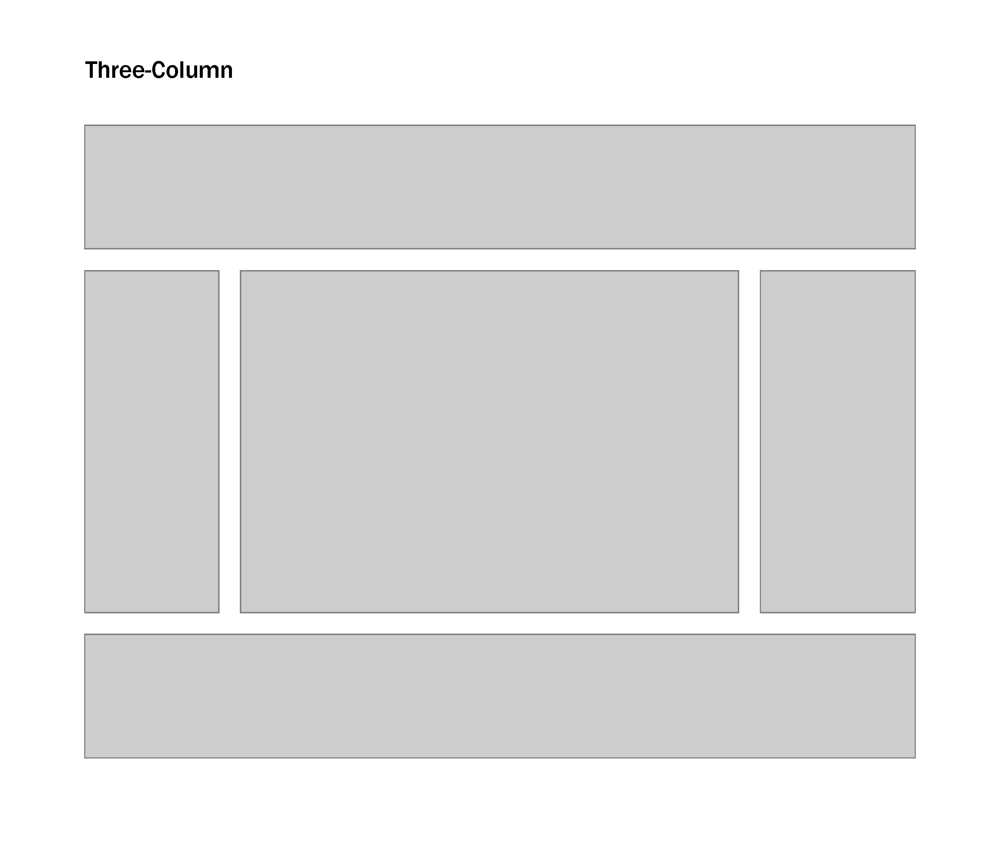
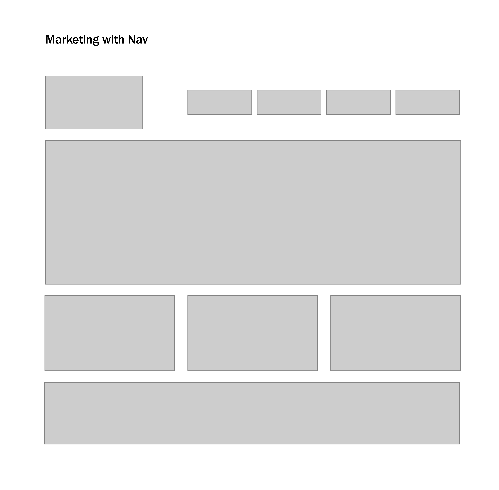
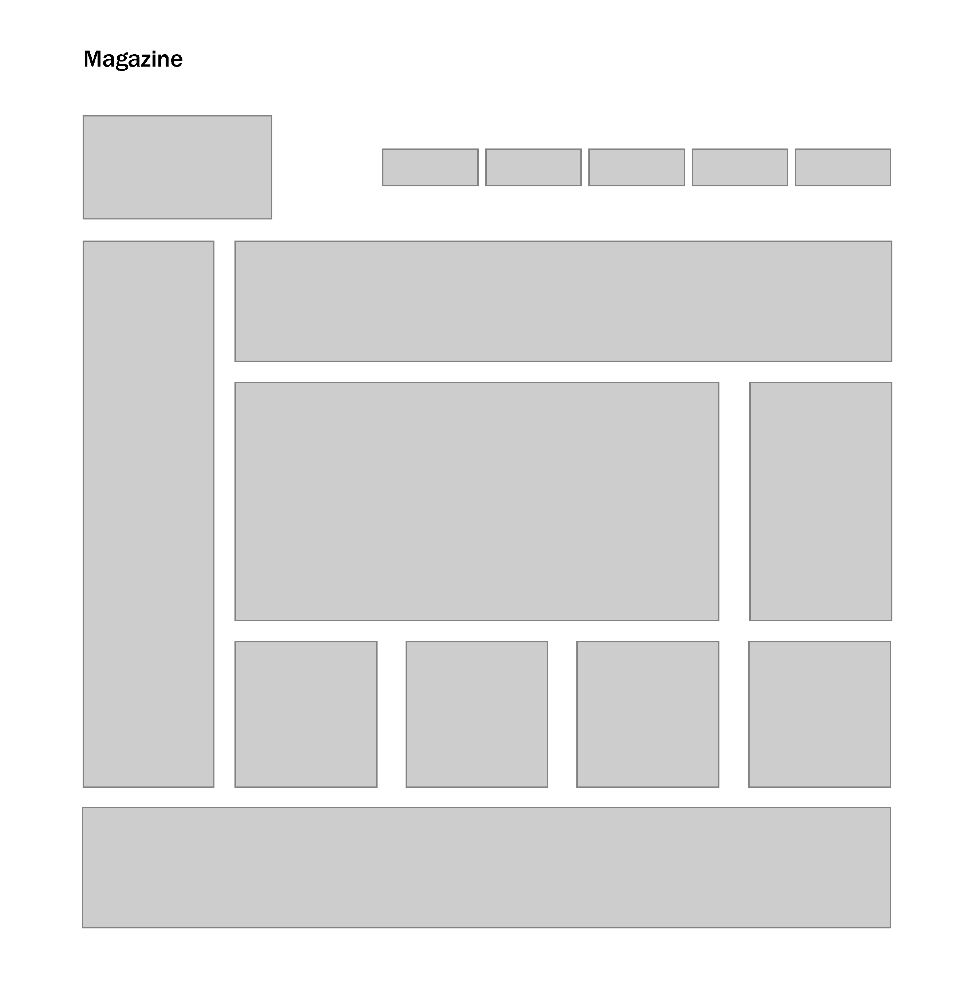

#FEWD - Layout

---

##Agenda

*	Review
*	Divs, Classes and IDs
* Developer Tools
* Browser Variances
*	Semantic HTML
*	Floats
*	Layout Lab

---

##Review

---


---

##Divs

* HTML div element is a generic container
* Used to group elements for styling purposes

```
<div>Header Content</div>

<div>
    <div>Left-side Content</div>
    <div>Right-side Content</div>
</div>

<div>Footer Content</div>
```

---

##Divs

* Accepts inline styling, classes, and IDs
* You can next divs inside of divs inside of divs

```
<div style="margin:0 auto; width:1200px;">Header Content</div>

<div class="container">
    <div class="container_left">Left-side Content</div>
    <div class="container_right">Right-side Content</div>
</div>

<div id="ftr">Footer Content</div>
```

---


##Code-Along: Error Message

Open error_message in Sublime Text.

---

##Classes and IDs

* IDs are unique
* Classes are not unique

```
#some-id { color: red; }

.some-class { color: blue; }
```

What color is the element's text?

```
<p id="some-id" class="some-class">an important paragraph.</p>
```

---

##Dev Tools - What are they?

* Allow us to peek under the hood
* Crucial for debugging
* Enable on-the-fly HTML and CSS changes (no SublimeText necessary!)
* Contains a JavaScript console!

---

##Dev Tools

Go to https://www.whitehouse.gov in Chrome.

OSX: ```command + option + i```
PC: ```F12```

---

##Dev Tools

Using console:
* What font is used for the hero article h1?
* What classes are used on the h2 titles inside the touts (cards)
* What color is used on the "Get Plugged In" header?
* What are the dimensions of the logo? What are the actual dimensions of the file?

---

##Browser Variances

Surprise - all browser's are different!
* HTML/CSS/JS differ, subtly
* No standard for what a ```h1``` should look like
* Developing consistent experience == headache

---

##Browser Variances

Solution: Reset or Normalize

---

##Browser Variances

Method 1: Reset

* Removes browsers' default styles
* http://meyerweb.com/eric/tools/css/reset/

---

##Browser Variances

Method 2: Normalize

* Make all browsers the same while maintaining some default styles
* You don't have to redeclare some styles
* https://necolas.github.io/normalize.css

---

##Semantic HTML

* The use of HTML markup to reinforce the semantics, or meaning, of information in webpages, rather than merely define its presentation or look
* Introduces meaning to the webpage, rather than just the presentation

---

##Semantic HTML

The following behave exactly like divs:

* ```header```
* ```footer```
* ```nav```
* ```section```
* ```aside```
* ```article```

---

##Semantic HTML

The following behave exactly like divs:

* ```header```: Defines a header for a document
* ```footer```: Defines a footer for a document
* ```nav```: Defines navigation links
* ```section```: Defines a section in a document
* ```aside```: Defines content aside from the page content
* ```article```: Defines an article (as in a blog or news site)

---


##Code-Along: Floating Sections

Open ```floating_sections``` in Sublime Text.

---

##Layout Lab

Open ```relaxr``` in Sublime Text.

---

##Homework: Layout Challenge

* Create separate HTML file for each layout
* Use a single CSS file
* Use floats to build the layouts

---


---



---


---



---


